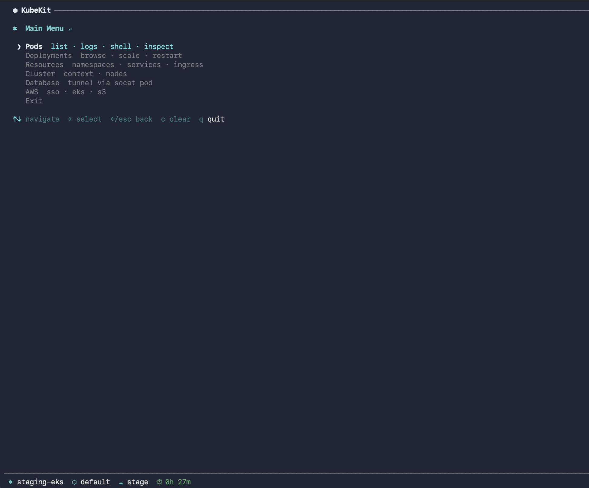

# KubeKit

A terminal UI toolkit for Kubernetes and AWS workflows. Navigate clusters, manage pods, forward database tunnels, and handle AWS SSO — all from an interactive menu.



## Features

- **Pod Management** — list, logs, shell, inspect
- **Deployments** — browse, scale, restart
- **Resources** — namespaces, services, ingress
- **Cluster** — context switching, node inspection
- **Database Tunnels** — forward via socat pod with multi-port support
- **Port Forwarding** — interactive service port forwarding
- **AWS** — SSO login, EKS context setup, S3 browsing
- **Animated TUI** — clean terminal UI with spinners and smooth navigation

## Install

### Homebrew

```bash
brew tap Tyka95/kube-kit
brew install kubekit
```

### Manual

```bash
git clone https://github.com/Tyka95/kube-kit.git
cd kube-kit
chmod +x kubekit.sh
./kubekit.sh
```

## Dependencies

| Dependency | Required | Install |
|-----------|----------|---------|
| `gum` | Yes | `brew install gum` |
| `kubectl` | Yes | `brew install kubectl` |
| `aws` | For AWS features | `brew install awscli` |
| `fzf` | Optional (enhanced filtering) | `brew install fzf` |

## Usage

```bash
kubekit.sh
```

Use arrow keys to navigate menus, Enter to select, Escape to go back.

```bash
kubekit.sh --version   # Print version
```

## Configuration

KubeKit reads `~/.config/kubekit/config` (simple `key=value` format). A
commented sample lives at [`docs/config.example`](docs/config.example).

| Key | Description |
|-----|-------------|
| `aws_regions` | Comma-separated regions offered in pickers. |
| `default_namespace` | Namespace used when the current context has none. |
| `default_profile` | AWS profile used by AWS actions (SSO, EKS setup, S3). |
| `db_target` | Database tunnel target, format `Name\|host\|port`. Repeat for multiple. |

Example:

```ini
aws_regions=us-east-1,eu-west-1
default_namespace=default
default_profile=my-profile
db_target=My DB|<cluster-writer-endpoint>|5432
```

The Database Tunnel picker lists every `db_target` from config, then any
Aurora cluster or standalone RDS instance auto-discovered via the AWS
SDK (current profile + region, results cached for 5 minutes under
`~/.local/state/kubekit/`), then a "Custom endpoint" option. The profile
is taken from the kubectl context's `AWS_PROFILE` exec env, falling back
to `$AWS_PROFILE` / `default_profile`; the region is derived from the
EKS context ARN.

The socat relay pod runs inside the current kubectl context, so
reachability depends on the cluster's VPC routing — not on the local
AWS profile.

## License

[MIT](LICENSE)
